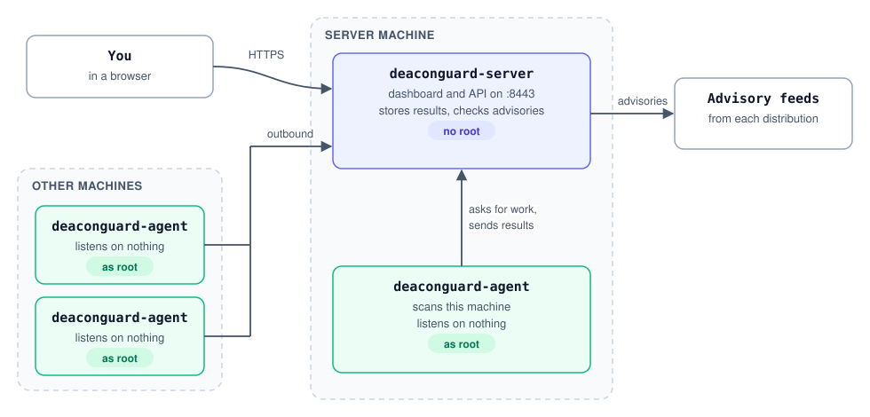

# DeaconGuard

[](https://github.com/Cloudopsshell/deaconguard/releases/latest)
[](https://github.com/Cloudopsshell/deaconguard/actions/workflows/ci.yml)
[](LICENSE)

DeaconGuard is a Linux security scanner written in Go. It runs fixed, read-only commands on a Linux machine and evaluates the installed packages against the distribution's own security data. Optional checks add system file integrity, malware and compromise indicators, security configuration, and an antivirus scan: Basic with ClamAV, or Advanced with ClamAV and YARA rules. The matching, checks, and scan orchestration are DeaconGuard code. Scans never install or change software; the only third-party engines they run are ClamAV and YARA-X, for the antivirus scan. The [install script](#install-script) installs them and the other tools the checks use, once, when it installs DeaconGuard.

## How it works

One binary does two jobs, and they are kept apart on purpose:

- **Server:** the HTTPS dashboard, with sign-in and an audit log. It stores results and checks packages against the advisories. It faces the network, so it runs **without root**, as the `deaconguard` user.
- **Agent:** runs on each machine to scan, **as root**, so every check sees everything. It listens on nothing: it connects out to the server, runs the scans the server asks for, and sends back the results.

**The server never scans anything itself.** Every machine, the server's own included, is scanned by its own agent. The install script gives the server's machine an agent too.

<picture>
  <source media="(prefers-color-scheme: dark)" srcset="assets/docs/architecture-dark.svg">
  
</picture>

| Component | Runs as | Listens on | Reaches |
| --- | --- | --- | --- |
| `deaconguard-server` | `deaconguard` user, no root | `0.0.0.0:8443` (HTTPS) | the distributions' advisory feeds |
| `deaconguard-agent` | root | nothing | only its server |

Agents enroll once with a one-time token from the server, valid for 24 hours. Machines to scan need no open ports and no internet access, because the server evaluates their packages against the advisories. More on how they trust each other: [Architecture](https://docs.deaconguard.io/architecture).

For a single machine, `deaconguard serve` gives a local dashboard without accounts.

**Website:** [deaconguard.io](https://deaconguard.io) · **Documentation:** [docs.deaconguard.io](https://docs.deaconguard.io) · **Quick start:** [docs.deaconguard.io/quick-start](https://docs.deaconguard.io/quick-start)

- [How it works](#how-it-works) · [Install](#install) · [Getting started](#getting-started) · [Run the server](#run-the-server) · [Scan other machines with the agent](#scan-other-machines-with-the-agent) · [Update](#update) · [Back up and restore](#back-up-and-restore) · [Uninstall](#uninstall)
- [Checks](#checks) · [Web UI](#web-ui) · [Supported distributions](#supported-distributions) · [Versioning](#versioning) · [Development](#development) · [Security](#security)

## Requirements

- **Where DeaconGuard runs:** Linux machines, amd64 or arm64, running a [supported distribution](#supported-distributions). It is a single self-contained binary, and nothing else is needed. The macOS builds can run the server and the CLI but cannot scan the Mac itself.
- **Account:** the agent service runs as root, so every check sees everything. The server service runs as its own `deaconguard` user. A normal account is enough for a local scan; the optional checks see more when [sudo is allowed](#checks).
- **Server memory:** give the server at least **1 GB of memory** (RAM plus swap). It checks each machine's package list against the distribution's feed, one machine at a time; for an Ubuntu 24.04 machine that briefly needs about 450 MB. With too little, Linux stops the server mid-scan, and the dashboard says so after it restarts.
- **Network:** the server needs HTTPS access to the distributions' advisory feeds. Agents only need to reach the server, on port 8443 by default.

## Install

Releases are published on the [Releases page](https://github.com/Cloudopsshell/deaconguard/releases). Each release has Linux and macOS archives, `.deb` and `.rpm` packages, `install.sh`, and a `checksums.txt` file with a [Sigstore signature](#verify-a-release) from the release workflow. Downloads need no GitHub account.

### Install script

The installer adds a system package and a service, so **it runs as root**: use `sudo` as shown, or run it as root without `sudo`.

On the server:

```sh
curl -fsSL https://get.deaconguard.io | sudo sh -
```

On each machine to scan, run the command shown by the server's **Enroll a machine** dialog. It carries the machine's one-time enrollment token:

```sh
curl -fsSL https://get.deaconguard.io | DEACONGUARD_TOKEN=deaconguard1.… sudo -E sh -
```

`sudo -E` hands the token to the installer through the environment, so it never appears on a command line other users of the machine can see. If your sudo rules don't allow `-E`, open a root shell with `sudo -i` and run the command without `sudo -E`.

`get.deaconguard.io` serves [`packaging/install.sh`](packaging/install.sh) from this repository's `main` branch. With `DEACONGUARD_TOKEN` the script sets up an agent; without it, a server. On a machine that is already an enrolled agent, it upgrades the agent. The script never asks for a password itself: started without root, it stops before doing anything and shows the command to use.

The script detects the distribution and architecture, then:

1. **Installs what DeaconGuard's checks use**, from the distribution's own signed repositories, on servers and agents alike:

   | For | Debian, Ubuntu | RHEL 8/9, Amazon Linux 2023 |
   | --- | --- | --- |
   | Malware check (`ps`, `find`) | `procps`, `findutils` | `procps-ng`, `findutils` |
   | Security configuration check (`ss`) | `iproute2` | `iproute` |
   | Pending-reboot check | (not needed) | `needs-restarting` |
   | Antivirus scan, Basic | `clamav`, `clamav-freshclam` | `clamav` and its updater; on RHEL from **EPEL**, which the script enables |

   It switches on ClamAV's signature updates (`clamav-freshclam`), which download about 110 MB of signatures in the background and keep them current. Already installed packages are left as they are.
2. **Installs [YARA-X](https://virustotal.github.io/yara-x/)** (`yr`, for the Advanced antivirus scan) and **[cosign](https://docs.sigstore.dev)** (to verify releases) to `/usr/local/bin`: each a pinned version, checked against a pinned checksum. A `yr` installed elsewhere, such as by a package, and an existing cosign are left as they are.
3. Downloads the `.deb` or `.rpm` package from GitHub over HTTPS, **verifies with cosign that `checksums.txt` was signed by this repository's release workflow**, and checks the package against it. DeaconGuard is not installed when a check fails. It then runs `deaconguard setup server`, which creates the first dashboard account and starts the server, or `deaconguard setup agent`, which enrolls the machine and starts the agent. Running it again upgrades DeaconGuard and keeps the existing setup.

- `curl … | DEACONGUARD_VERSION=0.4.0 sudo -E sh -` (or `curl … | sudo sh -s -- --version 0.4.0`) installs that release instead of the latest.
- `--server` or `--agent` choose the mode explicitly. Other options go to `deaconguard setup`, for example `curl … | sudo sh -s -- --listen 0.0.0.0:9443`; see [Run the server](#run-the-server) and [the agent](#scan-other-machines-with-the-agent).
- The script needs `curl`, `sha256sum`, systemd, and root. To read it before running it, open [get.deaconguard.io](https://get.deaconguard.io) in a browser, or download it first: `curl -fsSL https://get.deaconguard.io -o install.sh`, then `sudo sh install.sh`.

### Install the package yourself

Each method below downloads into `/tmp`, verifies the checksum, and installs. Set `VERSION` to the release you want; the machine's architecture (`amd64` or `arm64`) is detected for you. Then run `sudo deaconguard setup server` or `sudo deaconguard setup agent`.

#### Debian and Ubuntu

```sh
VERSION=0.1.1
ARCH=$(dpkg --print-architecture)
cd /tmp
curl -fsSLO "https://github.com/Cloudopsshell/deaconguard/releases/download/v${VERSION}/deaconguard_${VERSION}_linux_${ARCH}.deb"
curl -fsSLO "https://github.com/Cloudopsshell/deaconguard/releases/download/v${VERSION}/checksums.txt"
sha256sum --check --ignore-missing checksums.txt
sudo apt install "./deaconguard_${VERSION}_linux_${ARCH}.deb"
deaconguard version
```

#### RHEL, Fedora, and Amazon Linux

```sh
VERSION=0.1.1
ARCH=$(uname -m | sed 's/x86_64/amd64/; s/aarch64/arm64/')
cd /tmp
curl -fsSLO "https://github.com/Cloudopsshell/deaconguard/releases/download/v${VERSION}/deaconguard_${VERSION}_linux_${ARCH}.rpm"
curl -fsSLO "https://github.com/Cloudopsshell/deaconguard/releases/download/v${VERSION}/checksums.txt"
sha256sum --check --ignore-missing checksums.txt
sudo dnf install "./deaconguard_${VERSION}_linux_${ARCH}.rpm"
deaconguard version
```

#### Other Linux systems and macOS

```sh
VERSION=0.1.1
OS=$(uname -s | tr '[:upper:]' '[:lower:]')
ARCH=$(uname -m | sed 's/x86_64/amd64/; s/aarch64/arm64/')
cd /tmp
curl -fsSLO "https://github.com/Cloudopsshell/deaconguard/releases/download/v${VERSION}/deaconguard_${VERSION}_${OS}_${ARCH}.tar.gz"
curl -fsSLO "https://github.com/Cloudopsshell/deaconguard/releases/download/v${VERSION}/checksums.txt"
sha256sum --check --ignore-missing checksums.txt      # on macOS: shasum -a 256 --check --ignore-missing checksums.txt
tar -xzf "deaconguard_${VERSION}_${OS}_${ARCH}.tar.gz" deaconguard
sudo install -m 0755 deaconguard /usr/local/bin/deaconguard
deaconguard version
```

macOS builds can run the server and the CLI but cannot scan the Mac itself. They are not yet signed by Apple; if macOS blocks the first run of a browser download, allow it with `xattr -d com.apple.quarantine /usr/local/bin/deaconguard`.

With the [GitHub CLI](https://cli.github.com), `gh release download v0.1.1 -R Cloudopsshell/deaconguard -p 'FILE'` downloads a release file instead of `curl`.

#### From source

Requires Go 1.26 or later and, for the web UI, Node.js 24 with npm.

```sh
git clone https://github.com/Cloudopsshell/deaconguard.git && cd deaconguard
make build          # builds the web UI and the deaconguard binary
./deaconguard version
```

## Getting started

**Which mode do I need?** The same install runs in either mode:

| | Server mode | Local mode |
| --- | --- | --- |
| For | one dashboard for many machines | checking one machine on its own |
| Dashboard | `https://SERVER:8443`, with sign-in | `http://127.0.0.1:7480`, this machine only, no sign-in |
| Scans | every machine with an agent, as root, the server's own included | only the machine it runs on |
| Start with | [Run the server](#run-the-server), then [add agents](#scan-other-machines-with-the-agent) | the steps below |

### Local mode

On the Linux machine you want to scan, register it once and open the dashboard:

```sh
deaconguard host add                               # add --allow-sudo to let the deeper checks use sudo
deaconguard serve                                  # then open http://127.0.0.1:7480
```

or work in the terminal:

```sh
deaconguard host list
deaconguard scan HOST_ID --checks packages,malware,config
deaconguard report REPORT_ID --json
```

For a one-off scan without registering the machine:

```sh
deaconguard scan --local --checks packages,integrity,malware,config --allow-sudo
```

This local dashboard is served on the machine's loopback address only, without sign-in. To manage other machines, run the server instead.

## Run the server

The [install script](#install-script) does this for you. After installing the `.deb` or `.rpm` yourself, run:

```sh
sudo deaconguard setup server
```

It asks for the first dashboard account (the password needs at least 12 characters), enables and starts the `deaconguard-server` service on port 8443, gives this machine an agent of its own (see [How it works](#how-it-works)), and prints the dashboard's addresses, the certificate's fingerprint, and what runs on the machine. Running it again keeps the existing accounts and settings.

The server's own agent enrolls with the server over `127.0.0.1` and appears on the **Hosts** page as **This server**. On a server set up before 0.9.0, where this machine was added as a host scanned by the server itself (without root, so its results were partial), running setup again moves that host's scans, log entries, and schedules to the agent host.

Open `https://SERVER:8443` and sign in. On its first start, the server creates a self-signed certificate in `/var/lib/deaconguard/tls/`, so the browser warns about it once; check that the fingerprint matches the one setup printed. Agents don't rely on that warning being accepted: every enrollment token carries the fingerprint of the certificate's key, and an agent accepts the server only with that key, or with a certificate its system's certificate authorities trust for the server's name (so you can switch to your own certificate later).

`deaconguard setup server` options, which the install script passes on:

| Option | Use |
| --- | --- |
| `--listen ADDRESS:PORT` | Listen elsewhere than `0.0.0.0:8443`. |
| `--tls-cert FILE --tls-key FILE` | Use your own certificate. The `deaconguard` user must be able to read both files. Agents enrolled earlier keep working when the new certificate is trusted by their system for the server's name; otherwise enroll them again. |
| `--admin-user NAME --admin-password-file FILE` | Create the first account without prompts, for automation. Delete the file afterwards. |
| `--no-agent` | Give this machine no agent. It is then not scanned as root: adding it on the Hosts page has the server scan it without root, with partial coverage. Later runs remember the choice. |
| `--with-agent` | Add the agent after an earlier `--no-agent`. |

Setup saves these settings in `/etc/systemd/system/deaconguard-server.service.d/10-setup.conf`, so package upgrades keep them.

- **Manage accounts:** `deaconguard user add|passwd|remove USERNAME` and `deaconguard user list`, run as the `deaconguard` user. Every account is an administrator. Changing a password or removing an account signs it out everywhere.
- **Security:** failed sign-ins and enrollments are limited per address, sessions last 12 hours, and the **Audit log** page records sign-ins, tokens, enrollments, scans and removals.
- **Firewall:** only allow port 8443 from the networks where your admins and agents are.

To run the server in the foreground without systemd, use `deaconguard serve --listen 0.0.0.0:8443`. Any address other than loopback turns on HTTPS and sign-in.

## Scan other machines with the agent

1. On the server's **Agents** page, click **Enroll a machine**. Check the address agents will use to reach the server, then click **Create token**. On the server's command line, `deaconguard token create --server-url https://SERVER:8443` does the same.
2. On the machine to scan, run the command the dialog shows, as a user with sudo rights (as root, leave out `sudo -E`). It installs the same version as the server, enrolls the machine with the token, and starts the agent:

   ```sh
   curl -fsSL https://get.deaconguard.io | DEACONGUARD_VERSION=X.Y.Z DEACONGUARD_TOKEN=deaconguard1.… sudo -E sh -
   ```

   The token ends up in the shell history, but it enrolls only one machine and expires after 24 hours, so it is useless once used. To keep it out of the history anyway, run `curl -fsSL https://get.deaconguard.io | sudo sh -s -- --agent` and paste the token when asked. On a machine that already has DeaconGuard, `sudo deaconguard setup agent` asks for it. For automation such as cloud-init or Ansible, set `DEACONGUARD_TOKEN` or pass `--token-file FILE`; `--force` enrolls an already enrolled machine again.

3. The machine appears on the **Agents** and **Hosts** pages. Scan it from the dashboard like any other host, or with `deaconguard scan HOST_ID` on the server.

Each token enrolls one machine within 24 hours and can be revoked while unused. The agent stores its own credential in `/etc/deaconguard/agent.json`, readable by root only. Removing the host on the server revokes that credential at once, and the agent service then stops. Use `deaconguard agent status` on the machine to see where it is enrolled, and `journalctl -u deaconguard-agent` to see what it did.

The agent runs the checks and sends back the package list. The server evaluates the list against the advisories, so a compromised or modified agent can report false check results, but it cannot supply its own vulnerability verdicts.

## Update

Check your version with `deaconguard version` and read [CHANGELOG.md](CHANGELOG.md) for what changed; any upgrade steps are listed there. [Back up](#back-up-and-restore) your data before updating across a minor version.

| Installed with | Update |
| --- | --- |
| Install script | Run `curl -fsSL https://get.deaconguard.io \| sudo sh -` again, on the server and on each agent (an enrolled agent stays an agent); `DEACONGUARD_VERSION` with `sudo -E` picks a specific release |
| `.deb` | Run the [Debian and Ubuntu](#debian-and-ubuntu) steps with the new `VERSION` |
| `.rpm` | Run the [RHEL, Fedora, and Amazon Linux](#rhel-fedora-and-amazon-linux) steps with the new `VERSION` |
| Archive | Run the [archive](#other-linux-systems-and-macos) steps with the new `VERSION`; they replace `/usr/local/bin/deaconguard` |

Updating the package restarts running `deaconguard-server` and `deaconguard-agent` services. Stop a foreground `deaconguard serve` before replacing the binary and start it again afterwards. Update the server before its agents. The new version upgrades the database automatically on its first start; scans that were running when it stopped are marked as interrupted. Downgrading is not supported once a newer version has upgraded the database: restore the backup taken before the update instead.

## Verify a release

Releases are signed keyless with [Sigstore](https://www.sigstore.dev), like Kubernetes and Flux: `checksums.txt.sigstore.json` proves that this repository's release workflow produced `checksums.txt`, which lists every file of the release. No one holds a signing key that could leak. The install script checks it when cosign is installed; to check it yourself:

```sh
cosign verify-blob checksums.txt --bundle checksums.txt.sigstore.json \
  --certificate-identity "https://github.com/Cloudopsshell/deaconguard/.github/workflows/release.yml@refs/tags/vX.Y.Z" \
  --certificate-oidc-issuer https://token.actions.githubusercontent.com
```

Then check the files you downloaded with `sha256sum --check --ignore-missing checksums.txt`.

Each release's notes list the Go version and main libraries it was built with, and what the install script installs on each machine. The release also carries an SBOM, `deaconguard_X.Y.Z_sbom.spdx.json` (SPDX JSON), listing every Go module and web UI package with versions and licenses; `checksums.txt` covers it, so the signature does too.

## Back up and restore

All data lives in one directory: `/var/lib/deaconguard/` for the server service, `~/.local/share/deaconguard/` otherwise, or the path in `DEACONGUARD_HOME`. It holds:
- `deaconguard.db`: hosts, scan results, activity logs, accounts, tokens and the audit log. Passwords are stored as PBKDF2 hashes; tokens and credentials as SHA-256 hashes.
- `tls/`: the server's certificate and key. Keep them: agents trust this key.
- `feeds/`: a cache that is downloaded again if missing.

Files are readable only by their owner. To back up, stop the server (`sudo systemctl stop deaconguard-server`, or `deaconguard serve`) and copy the directory:

```sh
cp -a ~/.local/share/deaconguard ~/deaconguard-backup-$(date +%Y%m%d)
```

To restore, stop DeaconGuard and copy the backup back into place.

## Uninstall

```sh
sudo apt remove deaconguard                 # Debian and Ubuntu
sudo dnf remove deaconguard                 # RHEL, Fedora, Amazon Linux
sudo rm /usr/local/bin/deaconguard          # archive install
```

Uninstalling stops the services and keeps your data. To delete it as well, remove `/var/lib/deaconguard/` on a server, `/etc/deaconguard/` on an agent, and `~/.local/share/deaconguard/` (or your `DEACONGUARD_HOME`).

## Checks

Each scan runs the checks you choose, in the web UI's scan dialog or with `deaconguard scan HOST_ID --checks packages,integrity,malware,config,antivirus`. Package vulnerabilities is the default. The antivirus scan is **Basic** (ClamAV) by default; choose **Advanced** in the dialog, or add `yara` to `--checks`, to run YARA rules as well.

| Check | What it does | Commands |
| --- | --- | --- |
| Package vulnerabilities | Compares installed packages and the running kernel with official advisories (see [Supported distributions](#supported-distributions)). | `/etc/os-release`, the DPKG status file or `rpm -qa`, `uname -r` |
| System file integrity | Verifies packaged files against the package manager's checksums. Changed binaries and libraries, a classic rootkit sign, are reported; edited configuration files are counted but not reported. | `dpkg --verify` or `rpm -Va` |
| Malware & compromise indicators | Looks for crypto-miner processes, programs running from `/tmp`, `/dev/shm`, memory, or deleted files, programs disguised as kernel threads, `/etc/ld.so.preload`, hidden executables in temporary directories, and download-and-execute or reverse-shell patterns in cron and systemd. This is not a complete antivirus scan. | `/proc`, `ps`, `find` on temporary directories, cron and systemd files |
| Security configuration | Reports SSH root or password login, empty passwords, X11 forwarding, risky services such as Redis, databases, Telnet, or the Docker API listening on all interfaces, pending reboots, disabled automatic updates, and, with sudo, a missing host firewall. | sshd configuration, `ss`/`netstat`, reboot and update settings, firewall rules |
| Antivirus scan, Basic | Runs the host's own `clamscan` at low priority on temporary, home, and application directories and reports detections and signatures older than 7 days. Skipped when ClamAV is not installed, or when the host has less than about 1.5 GB of free memory and swap, since ClamAV loads its whole signature database into memory. | `clamscan` |
| Antivirus scan, Advanced | Everything Basic does, plus [YARA-X](https://virustotal.github.io/yara-x/) with the [YARA Forge](https://github.com/YARAHQ/yara-forge) **core** rules (about 5,000 public rules chosen for few false positives) on the same directories, for webshells, crypto miners, backdoors, and attacker tools. The server downloads the latest weekly rules from GitHub, keeps them for 12 hours, and sends them to agents with each scan; they are written to a private temporary file on the host and deleted afterwards. Each match is reported with the rule's author, a severity from its score, and its reference. Needs agent 0.5.0 or later; skipped when `yr` is not installed or the rules cannot be downloaded. | `yr scan` |

Every command is a fixed string in DeaconGuard's source; nothing from the user or the host is inserted into it.

By default checks run as the user running DeaconGuard, which cannot see other users' processes, protected files, or firewall rules; results then say they have partial coverage. Allow sudo (`--allow-sudo` when adding the machine or scanning it once, `deaconguard host sudo HOST_ID on`, or the switch on the host page) to run the same read-only commands through `sudo`. If sudo needs a password, the UI or terminal asks for it once per scan and keeps it in memory only; declining continues the scan without sudo. A skipped or failed check is never shown as clean.

## Web UI

`deaconguard serve` starts a local dashboard at <http://127.0.0.1:7480> (change the port with `--listen 127.0.0.1:PORT`); [the server](#run-the-server) serves the same dashboard over HTTPS with sign-in, plus the **Agents** and **Audit log** pages. Both have a **Logs** page. It shows each host's results, a severity overview, per-check results, full scan reports with search and filters, and scan history. Hosts can be added, removed, and scanned from the browser; the CLI and the UI share the same data.

The local dashboard only listens on a loopback address and rejects requests addressed to other host names. Both reject requests sent from other websites. While a scan runs, the host's page shows a live console with each step, every fixed command DeaconGuard runs (marked when it goes through sudo), how long each took, and findings as each check completes; it never shows command output or credentials. Each scan's activity log is saved with its results, so **View logs** in the scan history replays it later. Scan history keeps the 10 most recent scans per host, plus any older scan that still holds a check's latest result, and each scan can be deleted.

The **Schedules** page scans hosts automatically: give a schedule a name, its days and time in a time zone (daylight saving changes are handled), its hosts (all of them, including hosts added later, or chosen ones), and its checks. The server starts each run's scans as **Scan now** would, skipping a host that is already being scanned or whose agent is too old for a chosen check, and logging why. A run missed while the server was stopped happens once when it starts again. Schedules run **with root privileges** by default: every machine, the server's own included, is scanned by its agent as root. A schedule can turn root off; the dialog then reminds you that results show partial coverage. **Run now** starts a schedule's scans at once. Each host's page shows its next scheduled scan, and the dashboard flags hosts whose results are more than 7 days old. Creating, changing, running, and deleting schedules is recorded in the audit log, and scans a schedule starts name it as their starter.

The **Logs** page shows what the server and each agent did, newest first: server starts and stops (with why the previous run ended), agents connecting and going quiet, enrollments, each scan's start, finish, and failure, and every warning and error a scan reported. Agents from 0.6.0 send their own log to the server over their existing connection; lines from while the server was unreachable arrive once it answers again. Filter by server or agents, machine, level, and text; follow new entries live; or download the filtered log as text. Each host's page shows its latest entries. Entries are kept for 7 days, at most 100,000. Only signed-in accounts can read the log; downloads are recorded in the audit log, and so is viewing, at most once per account every 15 minutes. The services' journals (`journalctl -u deaconguard-server`, `journalctl -u deaconguard-agent`) still have everything too.

When sudo needs a password, the scan pauses and the browser asks for it. The answer goes to that one scan, is kept in memory only, and is never saved or logged. A wrong password can be retried up to three times; closing the dialog continues the scan without sudo, and an unanswered question stops the scan after 10 minutes.

## Supported distributions

- Ubuntu 18.04, 20.04, 22.04, 24.04, and 26.04 LTS: Canonical CVE OVAL package and running-kernel checks. Unsupported OVAL checks are listed, not treated as clean.
- Debian 12 (Bookworm) and 13 (Trixie): Debian Security Tracker package-source statuses and fixed versions.
- Amazon Linux 2023: ALAS RSS/bulletins and replacement RPM versions. Repository snapshots are immutable; AWS notes that bulletin pages and repository metadata can be temporarily inconsistent.
- Red Hat Enterprise Linux 8 and 9: Red Hat's official OVAL feeds. Unsupported OVAL checks are listed.

CentOS Stream 9/10 is recognized but deliberately rejected: the official repositories checked here publish no `updateinfo` metadata, and RHEL OVAL is not assumed to be compatible. RHEL 10 is not enabled because no official RHEL 10 feed was present in the verified Red Hat feed index. Amazon Linux 2, other RPM distributions, and end-of-life releases are not supported.

### What clears each finding

Every package finding says what clears it, on every supported distribution:

| Fix | Meaning | What to do |
| --- | --- | --- |
| Update available | The distribution published a fixed package. | `sudo apt update && sudo apt upgrade`, or `sudo dnf upgrade` (Amazon Linux 2023: `sudo dnf upgrade --releasever=latest`, because each machine stays on the release it was installed from) |
| Restart needed | The running kernel is vulnerable, and a fixed kernel is already installed. | `sudo reboot` |
| Old kernel | An older kernel that is installed but not running, kept as a fallback. | `sudo apt autoremove --purge` or `sudo dnf remove --oldinstallonly` |
| Ubuntu Pro | Ubuntu publishes the fix only in Ubuntu Pro (ESM). | `sudo pro attach` |
| No fix yet | The distribution knows about it but has not published a fix (Ubuntu's "needs fixing", Debian's open, no-dsa, and postponed). Updating cannot help until it does. | Nothing yet; it clears once a fix ships and you update. |

The dashboard leads with **To fix now** (updates and restarts) and lists the rest by what clears them, never as clean. Severity is the distribution's own rating: Ubuntu's priority, Debian's urgency, Red Hat's and Amazon's advisory severity. For Ubuntu, the generic CVSS rating is shown beside it when it differs, since Ubuntu's priority accounts for how the package is built and used on Ubuntu. Red Hat's and Amazon Linux's feeds only list issues that have a fix, so their findings are never "No fix yet".

Package reports cover the installed DPKG/RPM packages and the running kernel where the platform's feed supports it; they do not cover applications outside the system package manager or containers. The optional checks look for common signs of tampering and misconfiguration, not every possible compromise. No report is a claim that a machine is secure. Missing, invalid, stale-without-cache, or unsupported advisory data must not be interpreted as zero vulnerabilities.

## Versioning

DeaconGuard follows [Semantic Versioning](https://semver.org): `MAJOR.MINOR.PATCH`. Patch releases only fix bugs; minor releases add features. Before 1.0.0, a minor release may also contain breaking changes, always listed with upgrade steps in [CHANGELOG.md](CHANGELOG.md). Versions with a suffix, such as `0.2.0-rc.1`, are pre-releases for testing and are marked as such on GitHub. Every binary reports its version with `deaconguard version`, and each scan report records the version that produced it.

## Development

```sh
make build        # web UI and binary, version taken from the nearest git tag
make test vet     # Go tests and vet
make ui-dev       # web UI with hot reload on http://localhost:5173; run ./deaconguard serve alongside it
```

A plain `go build ./cmd/deaconguard` works without Node.js; the binary then explains that the web UI was not built. The UI source is in [web/](web/) and uses React, TypeScript, Vite, Tailwind CSS, TanStack Query, and React Router. Contributions are welcome: see [CONTRIBUTING.md](CONTRIBUTING.md) for the pull request process. Maintainers publish releases as described in [RELEASING.md](RELEASING.md).

## Security

Please report vulnerabilities in DeaconGuard privately, as described in [SECURITY.md](SECURITY.md), not in public issues.

## License

DeaconGuard is available under the MIT license. Advisory data remains the property and responsibility of its publishing distribution. Only scan systems you own or are authorized to scan.
